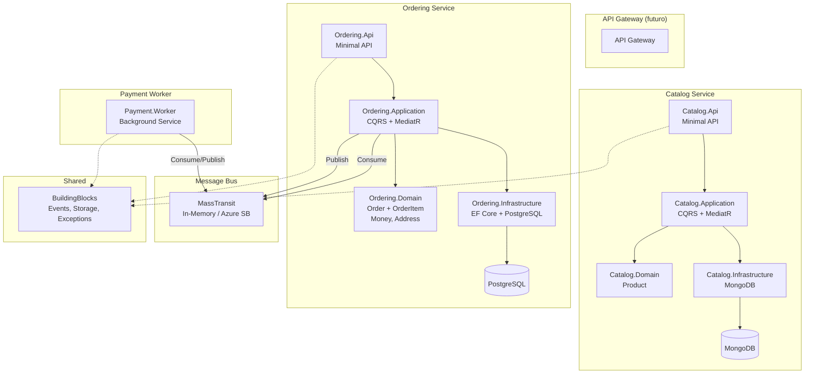
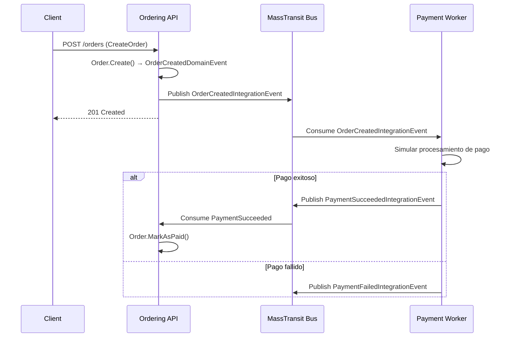

# ShopHub — Plataforma E-Commerce con Microservicios .NET 10

Plataforma de comercio electrónico construida con microservicios en .NET 10, diseñada para demostrar patrones empresariales modernos: Clean Architecture, DDD, CQRS, Event-Driven Architecture y prácticas DevOps.

## Arquitectura General



## Flujo de Eventos



## Estructura del Proyecto

```
ShopHub/
├── src/
│   ├── BuildingBlocks/          # Código compartido: eventos, storage, excepciones
│   ├── Services/
│   │   ├── Catalog/             # Servicio de catálogo (MongoDB)
│   │   │   ├── Catalog.Domain/
│   │   │   ├── Catalog.Application/
│   │   │   ├── Catalog.Infrastructure/
│   │   │   └── Catalog.Api/
│   │   ├── Ordering/            # Servicio de pedidos (PostgreSQL + EF Core)
│   │   │   ├── Ordering.Domain/
│   │   │   ├── Ordering.Application/
│   │   │   ├── Ordering.Infrastructure/
│   │   │   └── Ordering.Api/
│   │   └── Payment/
│   │       └── Payment.Worker/  # Worker de procesamiento de pagos
├── tests/
│   ├── Catalog.Domain.Tests/
│   ├── Ordering.Domain.Tests/
│   ├── Ordering.Infrastructure.Tests/
│   └── Payment.Worker.Tests/
├── docker-compose.yml
├── azure-pipelines.yml
└── ShopHub.slnx
```

## Cómo Levantar el Proyecto

### Prerrequisitos
- .NET 10 SDK
- Docker Desktop

### 1. Levantar infraestructura
```bash
docker compose up -d
```
Esto levanta:
- **shophub-mongo** en puerto `27017` (Catalog)
- **shophub-postgres** en puerto `5433` (Ordering)

### 2. Ejecutar servicios
```bash
# Terminal 1: Catalog API (puerto 5100)
dotnet run --project src/Services/Catalog/Catalog.Api

# Terminal 2: Ordering API (puerto 5102)
dotnet run --project src/Services/Ordering/Ordering.Api

# Terminal 3: Payment Worker
dotnet run --project src/Services/Payment/Payment.Worker
```

### 3. Ejecutar tests
```bash
dotnet test
```

## Mapa de Requisitos → Implementación

| Requisito | Dónde se implementa |
|---|---|
| Clean Architecture | 4 capas en cada servicio: Domain → Application → Infrastructure → Api |
| DDD (Entidades, Value Objects, Agregados) | `Ordering.Domain/Orders/Order.cs`, `Money.cs`, `Address.cs` |
| Domain Events | `OrderCreatedDomainEvent`, `OrderPaidDomainEvent` en `Ordering.Domain/Events/` |
| CQRS + MediatR | Commands/Queries en `*.Application/Products/Commands` y `*.Application/Orders/Commands` |
| Pipeline Behaviors | `LoggingBehavior.cs`, `ValidationBehavior.cs` en ambos servicios |
| EF Core + PostgreSQL | `OrderingDbContext`, owned types, enum→string, migraciones |
| MongoDB | `MongoProductRepository`, modelo de persistencia separado (`ProductDocument`) |
| Event-Driven (MassTransit) | Integration events en `BuildingBlocks/Events/`, consumers en cada servicio |
| Idempotencia | `PaymentSucceededConsumer` verifica estado antes de actuar |
| Multi-cloud storage | `IObjectStorage` con `AzureBlobStorage` y `AwsS3Storage` |
| Docker | Dockerfiles multi-stage para cada servicio |
| CI/CD | `azure-pipelines.yml` con Build_Test y Containerize |
| Logging estructurado | Serilog en ambas APIs |
| Manejo centralizado de errores | `GlobalExceptionHandler` con `IExceptionHandler` |
| Health checks | `/health` en ambas APIs |
| Testing | xUnit + FluentAssertions + NSubstitute + Testcontainers |

## Decisiones de Diseño y Trade-offs

1. **MongoDB para Catalog, PostgreSQL para Ordering**: Catalog es un agregado simple (Product) que se beneficia de la flexibilidad de documentos. Ordering tiene relaciones complejas (Order → OrderItems) con transacciones ACID, ideal para un modelo relacional.

2. **MassTransit in-memory**: Permite desarrollo y testing sin infraestructura externa. Para producción, solo se cambia el registro: `x.UsingAzureServiceBus(...)` con connection string de Azure Service Bus.

3. **Domain events → Integration events**: Los domain events (MediatR) se manejan dentro del bounded context. Los integration events (MassTransit) cruzan fronteras entre servicios.

4. **Value objects como records**: `Money` y `Address` son inmutables, con igualdad estructural automática. Usan owned types en EF Core para persistirse como columnas del agregado raíz.

5. **FluentAssertions v7**: Se usa v7 por ser la última versión open source. La v8 cambió a licencia comercial.

6. **Modelo de persistencia separado**: En Catalog, `ProductDocument` (con atributos de Mongo) está separado de `Product` (dominio limpio). En Ordering, EF Core mapea directamente la entidad con Fluent API.

## Cambiar a Azure Service Bus

En `Program.cs` de Ordering.Api y Payment.Worker, reemplazar:

```csharp
x.UsingInMemory((context, cfg) =>
{
    cfg.ConfigureEndpoints(context);
});
```

Por:

```csharp
x.UsingAzureServiceBus((context, cfg) =>
{
    cfg.Host("Endpoint=sb://your-namespace.servicebus.windows.net/;SharedAccessKeyName=...;SharedAccessKey=...");
    cfg.ConfigureEndpoints(context);
});
```

Y agregar el paquete `MassTransit.Azure.ServiceBus.Core`.
